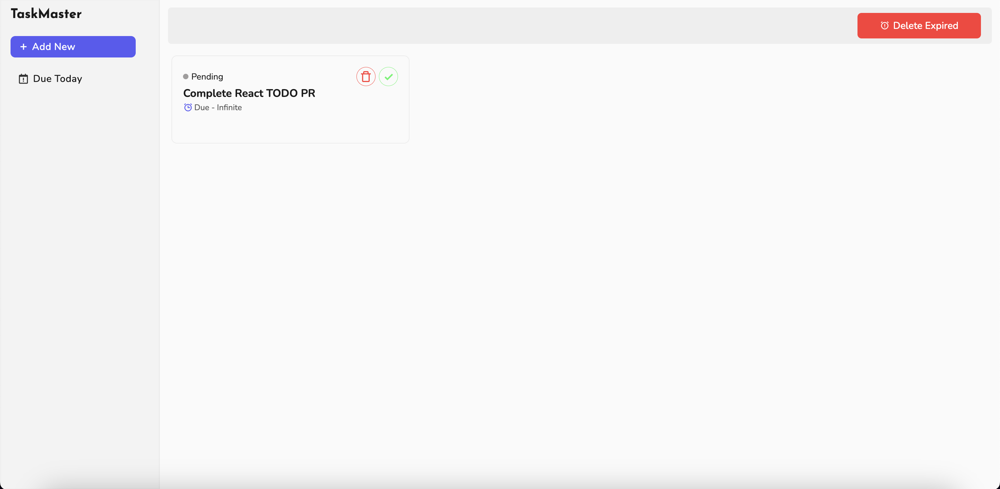
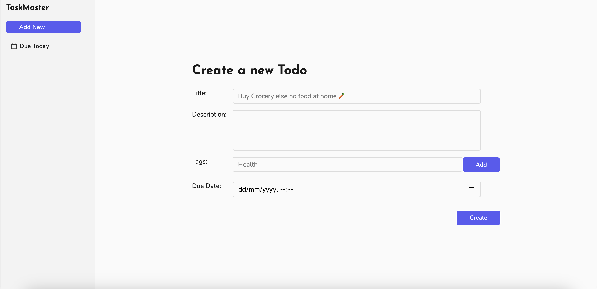
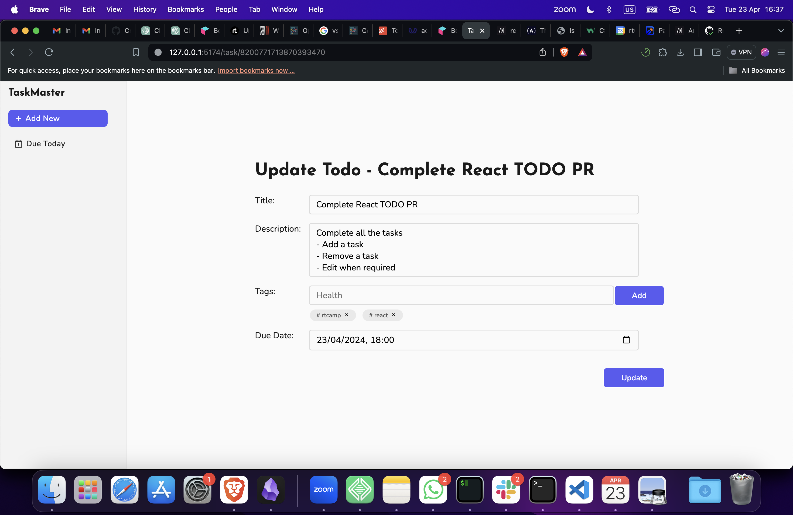
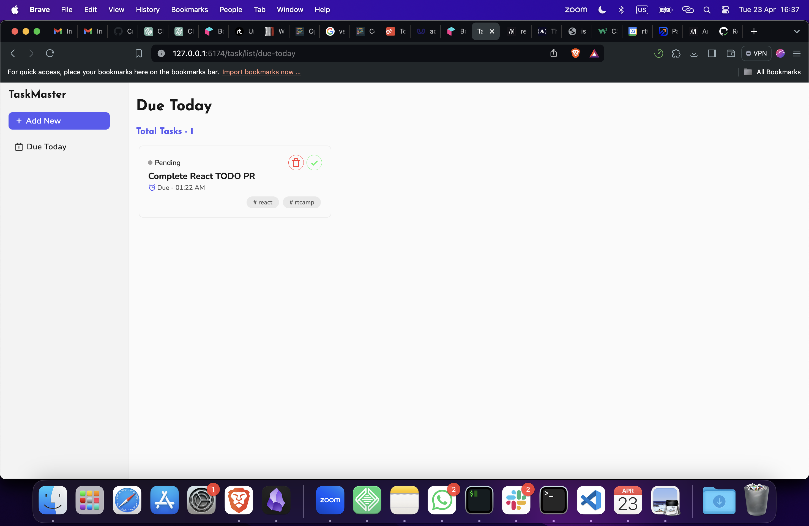

# TaskMaster
This app has a nice interface for todo that has a lot of features which the user can use to schedule.

### Features
1. Create Task - A user can create a complete task by clicking on Add Task Button on the Sidebar. Once that is done a form will open where the user can input the title, description of the task, the time it is due at and the tags associated with it.
2. Update Task - By Clicking on the Card for that Task a user can always update his existing todo data.
3. Delete Task - Click on Delete Icon on any card and your task will be deleted. 
4. Mark Complete - You can mark a task as complete by just clicking the tick icon on the card.

### Stored Data
In the todo the user can store the title to note for what the task is. Only this field is compulsory. One can also set the description that is the notes or any other supporting data alongside so as to make it easy to properly remember what to do.There is also a due time which user can set for a task expiry. A user will be notified on dashboard when the task has expired or is about to expire. One can also set the tags associated with the user.

### Directory Structure

    -- src -> The source files for the project.

        |

        | -- components -> Reusable components that are shared among pages

            |

            | -- stateless -> Those that do not have their own state.

            | -- stateful -> Those that do  have their own state.
        |

        | -- pages -> The pages required to display.

        |

        | -- service -> The layer that interacts with persistence layer.

        |

        | -- utils -> Holds the utility functions.
    
    -- assets -> The assets used in the project.

### ScreenShots
1. Home Page

2. Create Page

3. Update Page

3. Due Today Tasks Page
